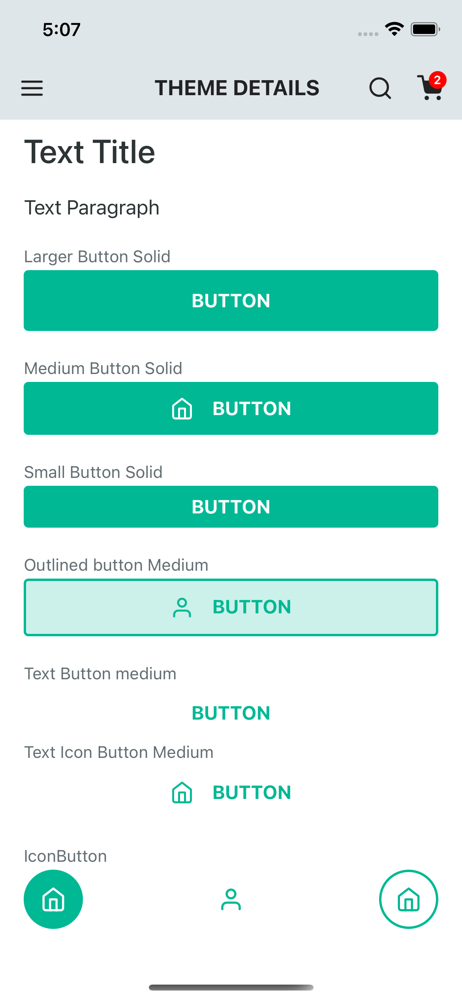
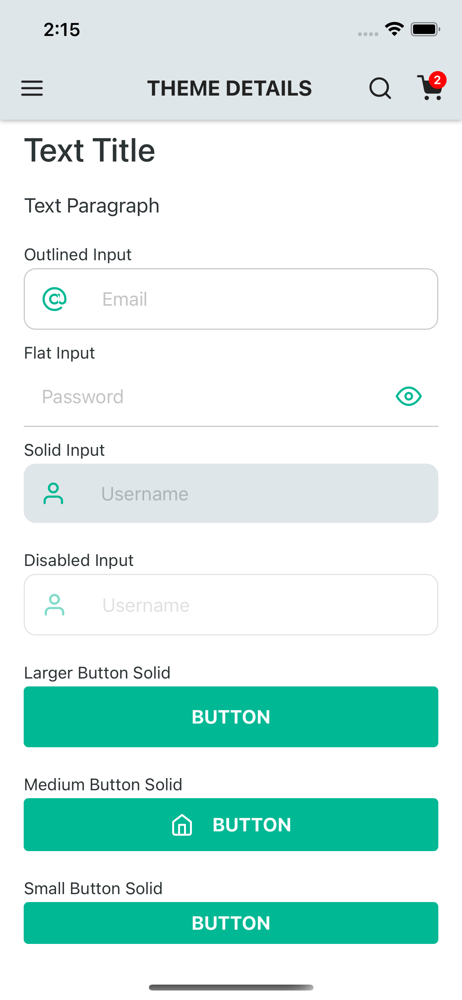

# React Native Skrull


a complete ui library to react native

| 01         | 02          |    03       |
|------------|-------------|-------------|
|  |  |  |

## Installation

```bash
yarn add rn-skrull
```

## Usage


#### Theme
Applying a theme to the whole app

```javascript
import { ThemeProvider } from 'rn-skrull';

export default function App {
    const theme = {
      colors: {
        primary: '#00b894',
        background: '#fffff',
        text: '#2d3436',
        label: '#636e72',
        appBar: {
          background: '#dfe6e9',
          color: '#222'
        }
      },
      components: {
        input: {
          unselectOutlineColor: '#ccc',
          placeholderTextColor: '#ccc',
          disabled: {
            opacity: 0.5
          },
          variants: {
            default: {
              borderRadius: 8,
              paddingHorizontal: 15,
              paddingVertical: 14,
              fontSize: 16
            },
            outline: {
              borderWidth: 2,
              borderRadius: 10
            },
            solid: {
              borderRadius: 10,
              borderWidth: 0,
              backgroundColor: '#dfe6e9'
            },
            flat: {
              borderRadius: 0,
              borderBottomWidth: 2
            }
          }
        }
        ...
      }
    };

  return (
    <ThemeProvider theme={theme}> // put your theme here
      <App />
    </ThemeProvider>
  );
}
```

You can also use the useTheme hook:
```javascript
import { useTheme, Button } from 'rn-skrull';

export default function App {
  const { colors } = useTheme();
  return (
    <Button style={{ backgroundColor: colors.primary }}>
      Button
    </Button>
  );
}
```

#### Stack
```javascript
import { Stack, Box, Center, Title } from 'rn-skrull';

<Stack align="center" direction="row" padding={20} />

<Box padding={20} backgroundColor="blue" borderColor="red" borderWidth={2} />

<Center>
    <Title> is the center</Title>
</Center>

// You can use all the properties available in react-native's ViewStyle interface.
```


#### AppBar

```javascript
import {AppBar, AppBarIcon, Button} from 'rn-skrull';

<AppBar
    title="Minha tela inicial"
    left={<AppBarIcon name="menu" />}
    right={() => (
      <>
        <AppBarIcon name="search" />
        <AppBarIcon badge={2} name="shopping-cart" />
      </>
    )}
  />
```

#### Buttons
```javascript
import { Button } from 'rn-skrull';

<Button icon="user" size="small" variant="outline">Button</Button>

```
| Props                | Value                         |
|----------------------|-------------------------------|
| size                 | "small" / "larger" / "medium" |
| icon                 | Jsx Icon                      |
| variant              | "outline" / "solid" / "text"  |
| onPress              | Function                      |
| style                | StyleSheet                    |
| disabled             | Boolean                       |
| isLoading            | Boolean                       |
| textStyle            | StyleSheet                    |

#### Inputs
```javascript
import { Input } from 'rn-skrull';

<Input placeholder="Email" prefix={<IconButton icon="at-sign" />} />

```
|      Props         |          Value         |
|--------------------|------------------------|
| placeholder        | String                 |
| prefix             | JSX Element            |
| suffix             | JSX Element            |
| variant            | outline / solid / flat |
| onChange           | Function               |
| style              | StyleSheet             |
| disabled           | Boolean                |

#### Title
```javascript
import { Title } from 'rn-skrull';

<Title>Text Title</Title>

```

#### Label
```javascript
import { Label } from 'rn-skrull';

<Label>Outlined button Medium</Label>

```

#### IconButton
```javascript
import { IconButton } from 'rn-skrull';

<IconButton icon="home" variant="solid" />
```
| Props      | Value                     |
|------------|---------------------------|
| icon       | IconSource                |
| variant    | outline / solid / default |
| onPress    | Function                  |
| style      | StyleSheet                |
| disabled   | Boolen                    |

#### Paragraph
```javascript
import { Paragraph } from 'rn-skrull';

<Paragraph>Text Paragraph</Paragraph>
```

#### Spacing
```javascript
import { Spacing } from 'rn-skrull';

<Spacing />
```
| Props      | Value       |
|------------|-------------|
| width      | Number      |
| height     | Number      |


#### ActivityIndicator
```javascript
import { ActivityIndicator } from 'rn-skrull';

<ActivityIndicator />
```
| Props      | Value                    |
|------------|--------------------------|
| color      | String                   |
| size       | small / larger / Number  |
| animating  | Boolean                  |
| style      | StyleSheet               |

## Contributing
Pull requests are welcome. For major changes, please open an issue first to discuss what you would like to change.

Please make sure to update tests as appropriate.

## License
[MIT](https://choosealicense.com/licenses/mit/)
