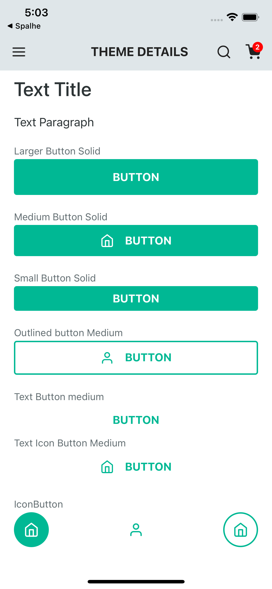

# React Native Skrull


a complete ui library to react native




## Installation

```bash
yarn add rn-skrull
```

## Usage

#### AppBar

```javascript
import {AppBar, AppBarIcon, Button} from 'rn-skrull';

<AppBar
   title="Title"
   left={<AppBarIcon name="menu" />}
   right={[
     <AppBarIcon name="search" />,
     <AppBarIcon badge={2} name="shopping-cart" />,
   ]}
/>
```
#### Buttons
```javascript
import { Button } from 'rn-skrull';

<Button icon="user" variant="outline">Button</Button>

```

#### Title
```javascript
import { Title } from 'rn-skrull';

<Title>Text Title</Title>

```

#### Label
```javascript
import { Label } from 'rn-skrull';

<Label>Outlined button Medium</Label>

```

#### IconButton
```javascript
import { IconButton } from 'rn-skrull';

<IconButton icon="home" variant="solid" />
```

#### Paragraph
```javascript
import { Paragraph } from 'rn-skrull';

<Paragraph>Text Paragraph</Paragraph>
```

#### Spacing
```javascript
import { Spacing } from 'rn-skrull';

<Spacing />
```

## Contributing
Pull requests are welcome. For major changes, please open an issue first to discuss what you would like to change.

Please make sure to update tests as appropriate.

## License
[MIT](https://choosealicense.com/licenses/mit/)
