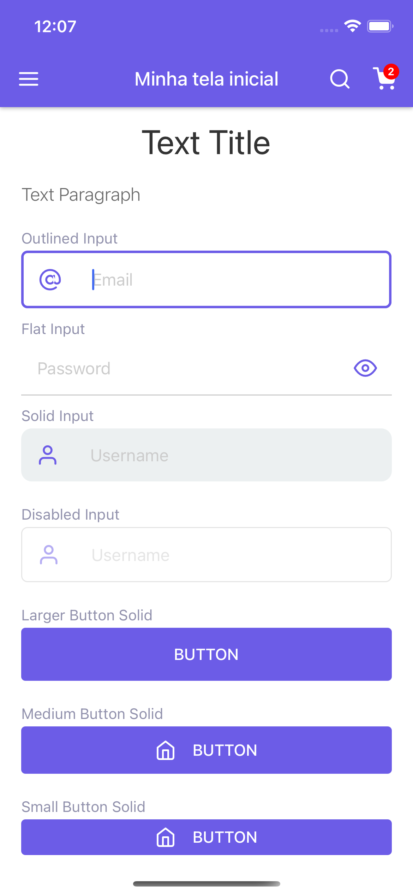
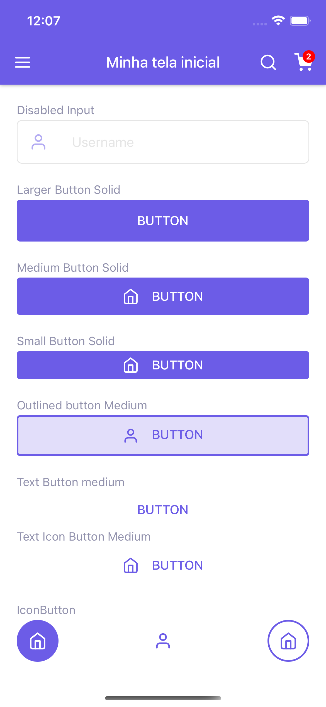

# React Native Skrull


a complete ui library to react native

| Theme Details      | Button Press     |
|------------|-------------|
|  |  |

## Installation

```bash
yarn add rn-skrull
```

## Usage


#### Theme
Applying a theme to the whole app

```javascript
import { ThemeProvider } from 'rn-skrull';

export default function App {
  return (
    <ThemeProvider theme={{background: '#fff', text: 'red'}}>
      <App />
    </ThemeProvider>
  );
}
```

You can also use the useTheme hook:
```javascript
import { useTheme, Button } from 'rn-skrull';

export default function App {
  const { theme } = useTheme();
  return (
    <Button style={{ backgroundColor: theme.primary }}>Button</Button>
  );
}
```


#### AppBar

```javascript
import {AppBar, AppBarIcon, Button} from 'rn-skrull';

<AppBar
   title="Title"
   left={<AppBarIcon name="menu" />}
   right={[
     <AppBarIcon name="search" />,
     <AppBarIcon badge={2} name="shopping-cart" />,
   ]}
/>
```

#### Buttons
```javascript
import { Button } from 'rn-skrull';

<Button icon="user" size="small" variant="outline">Button</Button>

```
| Props |    value       |
|------------|-------------|
| size |    small / larger / medium |
| icon |    IconSource or Feather icon name |
| variant |    outline / solid / text |
| onPress |   function |
| style |   StyleSheet |
| disabled |  true or false |
| loading |   true or false |

#### Title
```javascript
import { Title } from 'rn-skrull';

<Title>Text Title</Title>

```

#### Label
```javascript
import { Label } from 'rn-skrull';

<Label>Outlined button Medium</Label>

```

#### IconButton
```javascript
import { IconButton } from 'rn-skrull';

<IconButton icon="home" variant="solid" />
```
| Props |    value       |
|------------|-------------|
| icon |    IconSource or Feather icon name |
| variant |    outline / solid / default |
| onPress |   function |
| style |   StyleSheet |
| disabled |  true or false |

#### Paragraph
```javascript
import { Paragraph } from 'rn-skrull';

<Paragraph>Text Paragraph</Paragraph>
```

#### Spacing
```javascript
import { Spacing } from 'rn-skrull';

<Spacing />
```
| Props |    value       |
|------------|-------------|
| width |    number |
| height |    number |

#### ActivityIndicator
```javascript
import { ActivityIndicator } from 'rn-skrull';

<ActivityIndicator />
```
| Props |    value       |
|------------|-------------|
| color |    string |
| size |    "small" / "larger" / number  |
| animating |    true or false |
| style |   styleProps |

## Contributing
Pull requests are welcome. For major changes, please open an issue first to discuss what you would like to change.

Please make sure to update tests as appropriate.

## License
[MIT](https://choosealicense.com/licenses/mit/)
